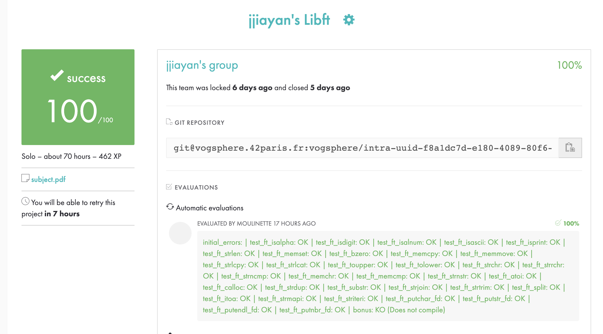
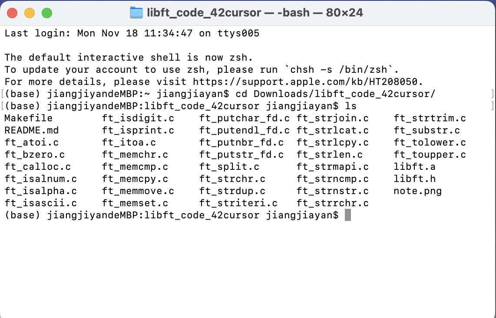
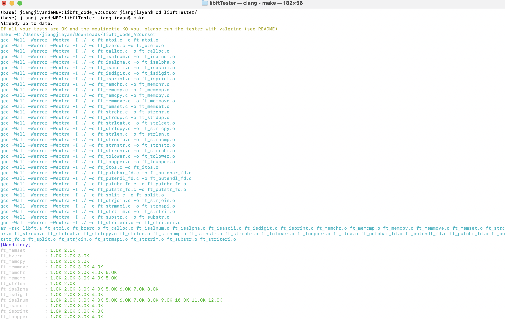

# libft_code_42cursor



## Comment le tester ?

1. Accédez au dossier contenant votre code libft.



2.[test_libft](https://github.com/Tripouille/libftTester)


3.Clone

``` bash
git clone git@github.com:Tripouille/libftTester.git

```
4.Tester

```bash
cd libftTester.git

make
```

